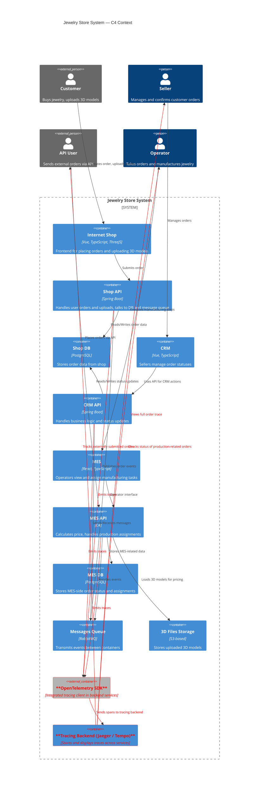

# Архитектурное решение по трейсингу

**Уязвимые точки, в которых заказ может сломаться:**

| Уязвимая точка                                                         | Система                   | Описание проблемы                                                   |
| ---------------------------------------------------------------------- | ------------------------- | ------------------------------------------------------------------- |
| Заказ создан (`SUBMITTED`), но не дошёл до MES                         | Онлайн-магазин + RabbitMQ | Проблема с отправкой или доставкой сообщения в очередь MES          |
| Сообщение доставлено, но MES не начал расчёт                           | MES                       | Потеря сообщения или сбой в обработчике очереди                     |
| Расчёт стоимости длится слишком долго или завис                        | MES                       | Внутренний сбой расчёта, перегрузка, ошибка в 3D-модели             |
| MES посчитал стоимость (`PRICE_CALCULATED`), но CRM не получил событие | RabbitMQ + CRM            | Потеря/задержка сообщения при передаче результата расчёта           |
| CRM не обновляет статус заказа на `MANUFACTURING_APPROVED`             | CRM                       | Ошибка в логике обработки, проблема с обновлением БД                |
| Операторы не видят заказ в MES (после `MANUFACTURING_APPROVED`)        | MES                       | Проблемы с отображением: фильтрация, баг в UI, ошибки запросов к БД |
| MES-оператор завершает заказ, но статус `SHIPPED` не доходит до CRM    | MES + RabbitMQ            | Ошибка при отправке события в CRM или сбой в CRM на приёме          |
| Заказ завершён, но CRM не переведён в `CLOSED`                         | CRM                       | Потеря финального сообщения или ошибка логики завершения заказа     |
| Сообщения теряются, не доходят до потребителя                          | RabbitMQ                  | Проблемы с очередями, отсутствие DLQ, нет ретраев                   |
| Дублирование сообщений или повторная обработка одного заказа           | RabbitMQ + MES + CRM      | Нарушения idempotency, сбои в логике обработки                      |

**Системы, которые следует покрыть трейсингом:**

1. Онлайн-магазин
2. MES
3. CRM
4. RabbitMQ

**Данные, которые должны попадать в трейсинг**:

* `trace_id` — общий идентификатор цепочки обработки заказа
* `span_id` — конкретный шаг обработки
* `parent_span_id` — родительский шаг
* `timestamp_start`, `timestamp_end`
* `status` — `success`, `error`, `timeout`, `skipped`
* `system` — `shop`, `MES`, `CRM`, `RabbitMQ`
* `operation` — `create_order`, `calculate_price`, `send_to_queue`, `update_status`, `receive_message`, …
* `order_id` — уникальный ID заказа
* `user_id` — инициатор заказа (если есть)
* `partner_id` — если заказ от B2B-клиента
* `source` — `web`, `api`
* `model_id` — ID загруженной 3D-модели
* `status_from`, `status_to` — если есть переход между статусами
* `processing_time_ms` — длительность операции

## Мотивация

### Что даст внедрение трейсинга

1. **Сквозная видимость жизненного цикла заказа**
     - можно точно определить, на каком этапе и в каком сервисе находится каждый заказ.

2. **Быстрая диагностика проблем**
     - при жалобе клиента команда сможет за секунды отследить весь путь заказа, включая сбои, таймауты и потерянные сообщения.

3. **Снижение потерь заказов и ошибок интеграции**
     - трейсинг поможет выявить, где и почему происходят сбои в RabbitMQ или API.

4. **Повышение доверия B2B-партнёров и клиентов**
     - компания сможет демонстрировать стабильность и прозрачность бизнес-процессов.

5. **Основа для алертов и автоанализа**
     - можно автоматически выявлять зависшие или необновляемые заказы.

### Метрики, на которые повлияет внедрение трейсинга

| Метрика                                              | Тип         | Влияние внедрения трейсинга                                       |
| ---------------------------------------------------- | ----------- | ------------------------------------------------------- |
| **Среднее время обработки заказа (end-to-end)**    | Бизнес      | Станет измеримым и управляемым по данным из трейсинга   |
| **Количество "зависших" заказов**                  | Бизнес      | Сократится за счёт своевременного обнаружения           |
| **Время на разбор инцидента (MTTR)**              | Техническая | Сократится в разы — инженер будет видеть полную цепочку |
| **Надёжность доставки сообщений между сервисами** | Техническая | Повысится за счёт визуализации и контроля цепочек       |
| **Процент заказов без полного жизненного цикла**  | Техническая | Будет видно, какие заказы не завершили нужный сценарий  |

## Предлагаемое решение

### Технологии:

* **OpenTelemetry SDK** — для генерации трейсингов в приложениях (`Java`, `C#`)
* **Jaeger** или **Grafana Tempo** — backend-хранилище трейсов
* **Grafana** — визуализация и поиск трейсов по `order_id`, `trace_id`

### Что нужно внедрить или доработать:

1. **Интеграция OpenTelemetry SDK** во все backend-приложения:

   * Онлайн-магазин (Java)
   * CRM (Java)
   * MES (C#)
2. **Интеграция трейсов в RabbitMQ producer/consumer** (логика отправки/приёма сообщений должна сохранять `trace_id`)
3. **Развёртывание и настройка backend-хранилища трейсинга** (Jaeger/Tempo)
4. **Передача `trace_id` в HTTP-запросах и сообщениях RabbitMQ**
5. **Добавление бизнес-меток (`order_id`, `status_from → status_to`) к трейсам**

### Обновленная C4 Context-диаграмма

## Компромиссы

1. **Проприетарные или закрытые компоненты**
  
   * Например: сторонние библиотеки расчёта стоимости в MES, интегрированные как «чёрный ящик».
   * **Компромисс**: такие компоненты нельзя напрямую «обернуть» в OpenTelemetry SDK — остаётся только логгировать до/после вызова.
   * **Вывод**: внутри таких блоков трейсинг невозможен, и необходимо полагаться на косвенные признаки (время выполнения, лог-сообщения, технические метрики).

2. **RabbitMQ без поддержки trace context в сообщениях**

   * По умолчанию RabbitMQ не сохраняет `trace_id`, если его явно не передавать.
   * **Компромисс**: требует явной модификации кода продюсеров и консюмеров сообщений.
   * **Вывод**: если такую модификацию не внедрить везде (особенно в legacy-коде), цепочка трейса будет обрываться, теряя смысл.

3. **Слабая зрелость команды или нехватка ресурсов**

     * Трейсинг требует дисциплины: нуужно не только внедрить SDK, но и поддерживать корректную маркировку спанов, передачу `trace_id`, проставление бизнес-меток (`order_id`, `status`).
     * **Компромисс**: при перегруженной команде или недостаточной экспертизе трейсинг может быть формальным и не давать пользы.
     * **Вывод**: в таких условиях лучше внедрить наблюдаемость поэтапно — с ключевых бизнес-кейсов и простых связок (например, Shop API ↔ RabbitMQ ↔ MES API).

4. **Низконагруженные или малозначимые операции**

   * Например: запросы к справочникам, проверка авторизации, health-check.
   * **Компромисс**: добавление трейсинга к таким операциям увеличит шум в системе, но не даст пользы.
   * **Вывод**: такие запросы стоит исключить из трейсинга (например, через фильтрацию).

5. **Высокие накладные расходы на хранение и передачу трейсов**

   * При большом объёме заказов каждый заказ генерирует десятки спанов, особенно в цепочках с RabbitMQ.
   * **Компромисс**: хранилище (Jaeger/Tempo) может перегружаться, особенно если не настроена агрегация или сэмплирование.
   * **Вывод**: нужно заранее спроектировать ограничения — например, сэмплировать только 10% обычных заказов и 100% ошибочных.

## Безопасность

Система трейсинга собирает технические и бизнес-данные (например, `order_id`, `user_id`, статусы заказов), поэтому должна быть защищена от несанкционированного доступа — как извне, так и внутри компании.

Основные меры безопасности, которые будут предусмотрены для системы трейсинга:

1. **Аутентификация пользователей**

   * **Что делаем**: интеграция с корпоративной системой учётных записей (SSO: OAuth2/SAML, LDAP или IAM от облака).
   * **Только сотрудники с ролями “Разработчик”, “DevOps”, “Поддержка”** смогут войти в систему трейсинга (например, Grafana/Jaeger UI).

2. **Ограничение доступа извне**

   * **Что делаем**:

     * Доступ к UI и API трейсинга — только из внутренней корпоративной сети или через VPN
     * При необходимости внешнего доступа — только по white листу IP и через защищённый шлюз
     * Публичный доступ к трейсингу категорически запрещён

3. **Шифрование данных в передаче и хранении**

     * **TLS**:

       * Все соединения между приложениями, OpenTelemetry Collector и хранилищем трейсинга — через HTTPS/TLS
     * **Хранение**:

       * Если используется внешний backend (например, Grafana Cloud или S3), включить шифрование ("encryption at rest")

4. **Аудит доступа и логирование**

     * **Что делаем**:

       * Все действия в UI трейсинга (входы, фильтрация, доступ к трейсам по `order_id`) логируются
       * Логи доступа доступны DevOps или службе безопасности

5. **Снижение чувствительности данных в трейсе**

     * Не писать:

       * Полные 3D-модели или содержимое файлов
       * Персональные данные (PII): имена, email, телефоны
     * Вместо этого использовать:

       * `order_id`, `partner_id`, `status`, `trace_id`
       * Хеши или токены, если нужно связать с внешними системами

Пример доступа к системе трейсинга

| Роль        | Пример сотрудника       | Доступ к трейсингу    | Уровень доступа               |
| ----------- | ----------------------- | --------------------- | ----------------------------- |
| Поддержка   | Служба поддержки B2C    | Да (через Grafana UI) | Только по `order_id`          |
| Разработчик | Backend-инженер         | Да                    | Полный trace + метаданные     |
| Менеджер    | Продакт или B2B-аккаунт | Нет                   | Только через отчёты/аналитику |
| Внешний API | Партнёр через API       | Нет                   | —                             |
