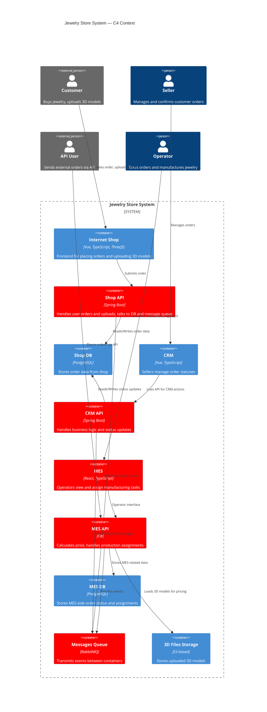

# Архитектурное решение по логированию

 Системы, из которых нужно собирать логи:

| Система      | Язык / Назначение         | Зачем нужны логи                                      |
| ------------ | ------------------------- | ----------------------------------------------------- |
| Shop API     | Spring Boot (Java)        | Логика создания заказов, загрузка моделей             |
| CRM API      | Spring Boot (Java)        | Обработка статусов, подтверждения, финализация        |
| MES API      | C#                        | Расчёт стоимости, распределение на операторов         |
| RabbitMQ     | Сообщения между системами | Логирование событий публикации/приёма/ошибок доставки |
| MES frontend | React                     | Ошибки при отображении заказов, проблемы с API        |

### **Список логов уровня `INFO`**:

Все логи должны быть **структурированными** (JSON), содержать ключевые поля: `order_id`, `user_id`, `partner_id`, `trace_id`, `timestamp`, `status`, `source_system`.

| Событие                          | Сервис                       | что логируем                                              |
| -------------------------------- | ---------------------------- | --------------------------------------------------------------- |
| Создание заказа пользователем    | Shop API                     | `order_id`, `user_id`, `status=SUBMITTED`, `trace_id`           |
| Загрузка 3D-модели               | Shop API                     | `order_id`, `file_name`, `file_size`, `upload_status`           |
| Публикация сообщения в RabbitMQ  | Shop API / MES API / CRM API | `order_id`, `queue_name`, `event_type`, `success`               |
| Получение сообщения из очереди   | MES API / CRM API            | `order_id`, `event_type`, `consume_status`, `latency_ms`        |
| Расчёт стоимости изделия         | MES API                      | `order_id`, `duration_ms`, `result=success/error`, `complexity` |
| Изменение статуса заказа         | CRM API                      | `order_id`, `status_from`, `status_to`, `user_id`, `timestamp`  |
| Назначение заказа оператору      | MES API                      | `order_id`, `operator_id`, `timestamp`, `priority`              |
| Завершение производства          | MES API                      | `order_id`, `status=MANUFACTURING_COMPLETED`, `duration`        |
| Ошибка UI при отображении заказа | MES frontend                 | `order_id`, `error_message`, `component`, `timestamp`           |

### **Дополнительные уровни логирования:**

| Уровень | Где и когда использовать                                                                                             |
| ------- | -------------------------------------------------------------------------------------------------------------------- |
| `ERROR` | Исключения, ошибки при расчёте, падения парсинга, сбои при отправке/получении сообщений, отказ от обновления статуса |
| `WARN`  | Таймауты, нестандартные задержки, недостающие поля, повторная обработка заказа                                       |
| `DEBUG` | Временное включение в dev/release при сложном разборе или тестировании нового бизнес-потока                          |

**Важно**: в продакшене прелагается использовать `DEBUG` точечно и ограниченно (например, через feature-флаг или по `order_id`).

## Мотивация

### Что компании даст внедрение логирования

1. **Снижение времени разбора инцидентов (MTTR)**
   — вместо ручного анализа по жалобе, инженер сразу видит путь заказа и ошибку в логах.

2. **Предиктивный контроль за проблемами**
   — можно отслеживать аномалии (зависшие статусы, повторные ошибки) ещё до обращений клиентов.

3. **Снижение нагрузки на поддержку и разработку**
   — специалисты поддержки смогут находить ответы на вопросы клиентов без привлечения инженеров.

4. **Прозрачность процессов для B2B-партнёров**
   — компания сможет объяснять, что происходило с заказом, и когда именно произошёл сбой.

5. **Повышение качества разработки**
   — логирование даёт количественную оценку ошибок и аномалий, что позволяет заранее выявлять технический долг.

### Метрики, на которые повлияет логирование

| Метрика                                         | Тип         | Как влияет логирование                               |
| ----------------------------------------------- | ----------- | ---------------------------------------------------- |
| Время анализа инцидента (MTTR)                | Техническая | Сокращается за счёт прямого доступа к событиям       |
| Количество «зависших» заказов                 | Бизнес      | Уменьшается за счёт логов о статусах и задержках     |
| Повторные обращения в поддержку              | Бизнес      | Снижается, т.к. проблемы находят и устраняют быстрее |
| Количество ошибок при интеграции через API   | Техническая | Можно точно отслеживать и анализировать причины      |
| Количество необработанных сообщений RabbitMQ | Техническая | Отслеживается через логирование consumer-ошибок      |

### Приоритет внедрения логирования и трейсинга

| Система      | Что внедрять                 | Приоритет      | Почему                                                                    |
| ------------ | ---------------------------- | -------------- | ------------------------------------------------------------------------- |
| **MES API**  | Логирование + трейсинг       | 1  | Узкое место: долгие расчёты, операторы не видят заказы, частые сбои.      |
| **CRM API**  | Логирование + трейсинг       | 2           | Часто жалобы связаны с тем, что заказ «не завершился» — лог нужен.        |
| **RabbitMQ** | Логирование                  | 2           | Потеря или сбой в доставке заказов — критично для надёжности цепочки.     |
| **Shop API** | Только логирование (сначала) | 3           | Реже точка сбоя, но важно фиксировать начало заказа и отправку в очередь. |

## Предлагаемое решение

### Технологии и архитектура логирования

**Компоненты, которые будут внедрены:**

| Компонент                  | Назначение                                           |
| -------------------------- | ---------------------------------------------------- |
| **Log Collector**          | Filebeat или Fluent Bit на каждом инстансе           |
| **Log Storage**            | Elasticsearch / OpenSearch или Grafana Loki          |
| **Аналитика**              | Grafana / Kibana для поиска и визуализации           |
| **Структурированные логи** | JSON-логи с ключевыми метками (`order_id`, `status`) |

**Модификации сервисов:**

* **Shop API**, **CRM API**, **MES API** — доработка логирования в формате JSON (например, через Logback/Serilog).
* **RabbitMQ consumers** — добавить логирование событий доставки и ошибок.
* **Фронтенд MES** — подключить Sentry для логирования ошибок UI.

```mermaid
%%{init: {'theme': 'default'}}%%
C4Context
title Jewelry Store System — C4 Context

Person_Ext(customer, "Customer", "Buys jewelry, uploads 3D models")
Person(seller, "Seller", "Manages and confirms customer orders")
Person_Ext(apiuser, "API User", "Sends external orders via API")
Person(operator, "Operator", "Takes orders and manufactures jewelry")

System_Boundary(jewelry, "Jewelry Store System") {

  Container(shopui, "Internet Shop", "Vue, TypeScript, ThreeJS", "Frontend for placing orders and uploading 3D models")
  Container(shopapi, "Shop API", "Spring Boot", "Handles user orders and uploads, talks to DB and message queue")
  Container(shopdb, "Shop DB", "PostgreSQL", "Stores order data from shop")

  Container(crmui, "CRM", "Vue, TypeScript", "Sellers manage order statuses")
  Container(crmapi, "CRM API", "Spring Boot", "Handles business logic and status updates")
  
  Container(mesui, "MES", "React, TypeScript", "Operators view and assign manufacturing tasks")
  Container(mesapi, "MES API", "C#", "Calculates price, handles production assignments")
  Container(mesdb, "MES DB", "PostgreSQL", "Stores MES-side order status and assignments")
  
  Container(rabbit, "Messages Queue", "RabbitMQ", "Transmits events between containers")
  Container(s3, "3D Files Storage", "S3-based", "Stores uploaded 3D models")

  %% === Logging Components (Red) ===
  Container_Ext(logagent, "**Log Collector (Filebeat/Fluent Bit)**", "Collects logs from services")
  Container(logstore, "**Log Storage (Loki / OpenSearch)**", "Central log repository for query and alerting")
  Container(logui, "**Log UI (Grafana / Kibana)**", "Search interface for support and devs")

  %% === Logging Flows (Red) ===
  Rel(shopapi, logagent, "Emits structured logs")
  Rel(crmapi, logagent, "Emits structured logs")
  Rel(mesapi, logagent, "Emits structured logs")
  Rel(rabbit, logagent, "Publishes queue delivery logs")
  Rel(logagent, logstore, "Sends logs")
  Rel(seller, logui, "Views logs to investigate issues")
  Rel(operator, logui, "Accesses limited production logs")

  %% === Existing Interactions ===
  Rel(customer, shopui, "Creates order, uploads model")
  Rel(shopui, shopapi, "Submits order")
  Rel(shopapi, shopdb, "Reads/Writes order data")
  Rel(shopapi, rabbit, "Publishes order events")
  Rel(seller, crmui, "Manages orders")
  Rel(crmui, crmapi, "Uses API for CRM actions")
  Rel(crmapi, rabbit, "Sends/Receives messages")
  Rel(crmapi, shopdb, "Reads/Writes status updates")
  Rel(mesapi, s3, "Loads 3D models for pricing")
  Rel(mesapi, rabbit, "Handles events")
  Rel(mesui, mesapi, "Operator interface")
  Rel(mesapi, mesdb, "Stores MES-related data")
  Rel(apiuser, mesapi, "Places orders via API")
  Rel(operator, mesui, "Executes manufacturing steps")
}


UpdateElementStyle(logagent, $bgColor="red")
UpdateElementStyle(logstore, $bgColor="red")
UpdateElementStyle(logui, $bgColor="red")

UpdateRelStyle(shopapi, logagent, $textColor="red", $lineColor="red")
UpdateRelStyle(crmapi, logagent, $textColor="red", $lineColor="red")
UpdateRelStyle(mesapi, logagent, $textColor="red", $lineColor="red")
UpdateRelStyle(rabbit, logagent, $textColor="red", $lineColor="red")
UpdateRelStyle(logagent, logstore, $textColor="red", $lineColor="red")
UpdateRelStyle(seller, logui, $textColor="red", $lineColor="red")
UpdateRelStyle(operator, logui, $textColor="red", $lineColor="red")
```

### Политика безопасности логов

1. **Доступ по ролям (RBAC)**

| Роль         | Права доступа                                   |
| ------------ | ----------------------------------------------- |
| Поддержка    | Доступ только к логам по `order_id` через UI    |
| Разработчики | Полный доступ по всем параметрам                |
| B2B-менеджер | Нет доступа (можно получать экспорт по запросу) |

1. **Обезличивание**

   * В логах не храним PII (имена, email, телефоны)
   * Логируем `user_id`, `partner_id`, `order_id`, `status`, `trace_id`

2. **Шифрование**

   * Данные передаются по HTTPS/TLS
   * В хранилище логов включено шифрование

3. **Аудит**

   * Доступ к логам фиксируется в системных логах Grafana/Kibana
   * Все действия записываются (просмотр, фильтрация, экспорт)

### Политика хранения логов

| Параметр                | Значение                                                        |
| ----------------------- | --------------------------------------------------------------- |
| **Индексация**          | Отдельный индекс/тег для каждого сервиса (`shop`, `mes`, `crm`) |
| **Срок хранения логов** | 30 дней по умолчанию, 90 дней для `ERROR`-уровня и инцидентов   |
| **Сжатие**              | Включено (gzip или zstd), экономия до 70% объёма                |
| **Оценочный объём**     | \~1–2 ГБ/день при структурированных логах JSON                  |
| **Архивация**           | Возможна выгрузка в S3 при необходимости                        |

## Мероприятия, необходимые для превращения системы сбора логов в систему анализа логов

### 1. Настройка алертинга по логам

**Цель**: автоматически уведомлять команду о критичных событиях и отклонениях от нормы.

**Что нужно сделать:** настроить шаблоны алертов в Grafana / OpenSearch:

| Событие                                        | Условие                                                     | Реакция                         |
| ---------------------------------------------- | ----------------------------------------------------------- | ------------------------------- |
| Ошибки `ERROR` уровня                          | > 5 сообщений за 1 минуту по `mesapi`, `crmapi`, `shopapi`  | алерт в мессенджеры          |
| Ошибка доставки в RabbitMQ                     | Сообщения с `delivery_failed=true` в логах очереди          | тикет + алерт для DevOps |
| Ошибки расчёта стоимости (`mesapi`)            | `calculation_result=error` или `timeout`                    | алерт для разработчиков                 |
| Ошибки в API-подключении партнёров             | `source=api_user` и `status_code=5xx` более 10 раз в минуту | оповещение в мессенджеры                |
| Повторная попытка обновить один и тот же заказ | >3 одинаковых логов `update_status` по одному `order_id`    |  тикет                   |

### 2. Поиск аномалий

**Цель:** обнаруживать подозрительные всплески активности, автоматические атаки, сбои интеграции.

**Что нужно сделать:** настроить аномальные шаблоны:

| Аномалия                                | Условие                                                          | Что делать                       |
| --------------------------------------- | ---------------------------------------------------------------- | -------------------------------- |
| Всплеск заказов                         | Было 4–5 заказов/сек, стало >1000/сек                            | Возможный DDoS или API-спам - блокировка ip      |
| Нестандартная частота 500-ошибок        | 500+ ошибок от одного `user_id` или `partner_id`                 | Заблокировать, провести анализ   |
| Частые повторы логов с одной 3D-моделью | Одни и те же `model_id`, `file_name` в логах => циклический вызов | Проверить партнёрскую интеграцию |
| Необычная география IP (если есть)      | Заказы с нетипичных IP или регионов                              | Проверка на взлом API-ключа      |

---

### 3. Обогащение логов для анализа

**Цель:** делать логи не только техническими, но и удобными для бизнес-аналитики и поддержки.

**Что нужно добавить:**

* `order_id`, `user_id`, `partner_id`, `trace_id`, `operation_type`, `status_from => status_to`, `duration_ms`
* для API — `user_agent`, `ip_address`, `rate_per_second`
* для RabbitMQ — `queue_name`, `message_type`, `ack_status`

### 4. Настройка дашбордов

**Цель:** сделать состояние системы видимым в реальном времени.

**Дашборды:**

* **Ошибки по сервисам** (shop, crm, mes) — с фильтрацией по trace\_id / order\_id
* **Состояние очередей** (RabbitMQ) — задержки, отклонения
* **Изменения статусов заказов** — сколько заказов в каждом статусе, есть ли "подвисшие"
* **Последние инциденты** — ошибки, таймауты, повторы

### 5. Безопасность и контроль

* Настроить **ротацию и маскирование чувствительных данных** (email, IP, PII)
* Включить **аудит доступа к логам** — кто, что и когда смотрел

