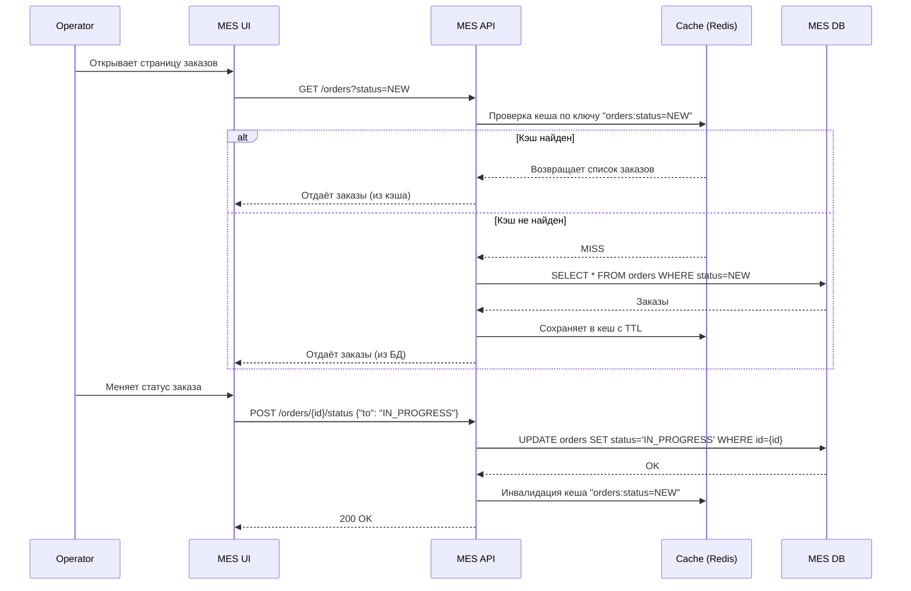

# Архитектурное решение по кешированию

**Что стоит кэшировать:**

| Что кэшировать                         | Где                                     | Почему                                                        |
| -------------------------------------- | --------------------------------------- | ------------------------------------------------------------- |
| **Результаты расчёта стоимости**       | Внутри MES API (Redis / memory)         | Модели часто повторяются или меняются незначительно           |
| **Список заказов для операторов**      | MES API или MES UI (localStorage/Redis) | Данные часто запрашиваются с одними и теми же фильтрами       |
| **3D-модели метаданных (ID, размеры)** | MES API                                 | Повторное извлечение из хранилища замедляет процесс           |
| **Фиксированные справочники**          | MES UI                                  | Например: статусы, типы изделий — не нужно грузить каждый раз |
| **Промежуточные статусы заказа**       | MES API                                 | Снижаем количество обращений к БД на каждый шаг обновления    |

## Мотивация

Сейчас система MES испытывает две ключевые проблемы:

1. **Медленная работа интерфейса для операторов**
   — при открытии страницы заказы загружаются долго, часто по 3–5 секунд.
   — фильтрация, переключение между статусами и обновления требуют повторных обращений к БД.

2. **Долгое ожидание расчёта стоимости**
   — расчёт производится синхронно, ресурсоёмок, и повторяется даже для схожих моделей.
   — пользователи и партнёры недовольны временем ожидания ответа.

Это влияет на операторов, клиентов и бизнес:

* Операторы работают медленно и с раздражением.
* Новые пользователи уходят, не дождавшись результата.
* Система плохо масштабируется при росте заказов.

### Что поможет решить кеширование 

* **Ускорит отклик интерфейса MES** — не нужно каждый раз обращаться в БД для одних и тех же данных.
* **Сократит нагрузку на MES API и БД** — особенно в часы пиков.
* **Сделает повторные расчёты мгновенными** — уменьшает время ответа с минут до миллисекунд.
* **Позволит гибко масштабироваться** — кэш позволяет снизить зависимость от скорости вычислений.

### Какие элементы системы планируется включить в кеширование

| Компонент           | Что кешируется                               | Где                                          |
| ------------------- | -------------------------------------------- | -------------------------------------------- |
| **MES API**         | Результаты расчёта стоимости                 | Redis или in-memory по `model_hash + params` |
| **MES API**         | Списки заказов для операторов                | Redis с TTL, кэш по фильтру и оператору      |
| **MES API**         | Метаданные моделей (размер, имя, валидность) | Redis для промежуточных этапов               |
| **MES UI (клиент)** | Фильтры, справочники, последние действия     | localStorage (браузерный кэш)                |
| **3D Files (S3)**   | Проверенные модели                           | Хеши и валидность могут кешироваться в Redis |

## Предлагаемое решение

Мы внедрим **оба вида кеширования**: **серверное** и **клиентское** — с разными целями и на разных уровнях.

| Тип кеша            | Что кешируем                               | Почему                             | Паттерн           |
| ------------------- | ------------------------------------------ | ---------------------------------- | ----------------- |
| Серверный (MES API) | Результаты расчёта, списки заказов         | Снижает нагрузку, ускоряет ответы  | **Cache-Aside**   |
| Клиентский (MES UI) | Фильтры, справочники, просмотренные заказы | Повышает UX, уменьшает API-запросы | — (встроено в UI) |

### Серверное кеширование

Где - **MES API**

* Кешируются ресурсоёмкие или часто повторяющиеся данные:

  * результаты расчёта стоимости моделей
  * списки заказов по часто используемым фильтрам
  * метаданные 3D-моделей

**Почему серверное:**

* Основной источник нагрузки и задержек — на стороне сервера (БД, расчёты, очередь).
* Устраняется повтор вычислений, повторные SQL-запросы.
* Можно централизованно управлять данными, TTL и инвалидацией.

**Выбранный паттерн:** Cache-Aside

#### Почему Cache-Aside:

* Хорошо подходит для **ресурсоёмких, но неизменяемых** данных (например, результат расчёта стоимости).
* Не требует изменения бизнес-логики (встраивается снаружи).
* Гибок: легко очищать, обновлять или обойти кэш.

#### Почему **не Write-Through**:

* Этот паттерн записывает в кэш при каждом изменении БД. => В MES расчёт результата не идёт "от данных", а инициируется вызовом → write-through не подходит.

#### Почему **не Refresh-Ahead**:

* Подразумевает предзагрузку кэша перед его истечением. => Неэффективно для редко используемых фильтров и непредсказуемых расчётов.

### Клиентское кеширование

Где - **MES UI (браузер)**

Кешируются:

* Выбранные фильтры
* Справочные данные (статусы, типы изделий)
* Последние просмотренные заказы

**Почему клиентское:**

* Устраняет избыточные запросы к API при навигации и обновлении страницы.
* Повышает отзывчивость интерфейса для операторов.
* Работает независимо от бекенда и защищён от высокой нагрузки.

### Sequence диаграмма

### Педлагаемая стратегия инвалидации кеша в MES

Для повышения производительности MES и сохранения актуальности данных мы внедряем **серверное кеширование** с использованием Redis и применяем **инвалидацию кеша по ключу (программную)**, дополняя её **временной (TTL)** стратегией.

#### Основная: **Инвалидация по ключу (программная)**

* При изменении статуса заказа (или других действий, влияющих на отображение в списке) **удаляется соответствующий ключ** из Redis.
* Примеры ключей:

  * `orders:status=NEW`
  * `orders:operator=123`
  * `orders:status=IN_PROGRESS&operator=456`

#### Дополнительная: **Временная (TTL)**

* Все кэшируемые значения имеют TTL:

  * списки заказов: 5–15 минут
  * результаты расчёта стоимости: до 6 часов
* Используется для автоматической очистки редко обновляемых данных.

#### Сравнительный анализ стратегий инвалидации

| **Критерий**                     | **Временная (TTL)**                  | **По запросам**                          | **На основе изменений**                 | **Программная**                    | **По ключу**                          |
| -------------------------------- | ------------------------------------ | ---------------------------------------- | --------------------------------------- | ---------------------------------- | ------------------------------------- |
| **Актуальность данных**          | ⚠️ Ограниченная — до TTL             | ❌ Зависит от поведения, не от данных     | ✅ Высокая — реагирует на изменения      | ✅ Высокая — зависит от логики      | ✅ Высокая — управляется вручную       |
| **Контроль через бизнес-логику** | ❌ Нет                                | ❌ Нет                                    | ⚠️ Частично (при наличии триггеров)     | ✅ Полный контроль                  | ✅ Полный контроль                     |
| **Предсказуемость поведения**    | ✅ Проста и понятна                   | ❌ Нет — зависит от активности            | ⚠️ Зависит от места применения          | ✅ Полная — логика в коде           | ✅ Полная — логика + структура ключей  |
| **Сложность реализации**         | ✅ Простая                            | ⚠️ Средняя                               | ⚠️ Средняя/высокая                      | ⚠️ Средняя — нужна дисциплина      | ⚠️ Средняя — проектирование ключей    |
| **Защита от устаревших данных**  | ✅ Да (автоочистка)                   | ❌ Нет                                    | ✅ Да — при корректной реализации        | ✅ Да                               | ✅ Да                                  |
| **Масштабируемость и гибкость**  | ⚠️ Ограниченная                      | ⚠️ Плохо масштабируется                  | ⚠️ Требует мониторинга                  | ✅ Высокая — кастомно настраивается | ✅ Высокая — легко таргетировать ключи |
| **Применимость для MES**         | ✅ Вспомогательная (справочники, TTL) | ❌ Нет — поведение не определяет свежесть | ⚠️ Частично (но дублируется программно) | ✅ Основной подход                  | ✅ Критически важный элемент           |
